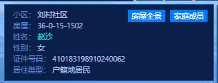

# 基于`thingjs`的社区平台

## 搜索框及搜索列表

搜索框：

- 搜索类型选择（房屋、人员）
  - 房屋搜索
    - 搜索条件：社区、小区、楼栋、单元、楼层、房屋（前后关联）
    - 选择上一个条件，去获取下一个条件的数据（点击社区，获取社区对应的小区；点击小区，获取小区对应的楼栋）
    - 如果上一个条件置空，后边的所有条件都置空
    - 至少选择社区后，搜索框才可用
    - 结果：显示房屋列表，场景切换到与搜索条件对应的层级
  - 人员搜索
    - 搜索条件：社区、姓名、证件类型、证件号
    - 证件类型和证件号前后关联，如果证件类型为空，则证件号不可输入
    - 结果：显示搜索列表

搜索列表中：

- 房屋搜索，house列表
  - 点击【家庭成员】按钮，可查询并展示该房屋的家庭成员列表；
  - 点击【房屋全景】按钮，可在场景中切换至房屋结构（需要一定的时间）

- 人员搜索，person列表
  - 点击【家庭成员】按钮，可查询并展示该房屋的家庭成员列表；
  - 点击【房屋全景】按钮，可在场景中切换至房屋结构（需要一定的时间）

## 场景

层级关系:

- Campus层级 -- 主场景
- Building层级 -- 包含有楼层的楼栋结构
- Floor层级 -- 包含有房屋的楼层结构
- Room层级 -- 房屋

注：在场景中，双击对象进入下一层级；右击，返回上一层级

进入

1. 进入Campus层级，所做的操作：

   - 显示所有楼层的详情框
   - 飞行至主视图

2. Campus层级-->Building层级，所做的操作：

   - 隐藏所有楼层的详情框

   - 根据楼栋name，判断是否需要隐藏底部两层（部分楼栋内部结构一致，但底部两层为商户，但模型是同一个）
   - 展示该楼栋的house列表
   - 标识楼栋加载完成
   - 自定义飞行过程

3. Building层级-->Floor层级，所做的操作：

   - 自定义飞行过程
   - 其他楼层淡出（注意，如果是商户--没有`userData/dbId`属性，需隐藏外墙）
   - 标识该楼层的各房屋
     - 获取当前楼层不重复的房屋
     - 以不同的颜色标识各房屋
     - 对房屋号进行再处理，得到单元号、新的房屋号，将其存储在各房屋的属性中
     - 计算每个房屋的中心点，创建并显示包含有【楼栋-单元-楼层-房屋号】的详情框
     - 查询数据库中的房屋详情，将真实数据挂载到对应的房屋属性中
   - 显示该楼层的房屋列表

4. Floor层级-->Room层级，所做的操作：

   - 自定义飞行过程
   - 高亮该房屋
   - 显示该房屋的house列表

退出：

1. Room层级-->Floor层级，所做的操作：
   - 清除高亮，显示其原有的标识颜色
2. Floor层级-->Building层级，所做的操作：
   - 自定义飞行过程
   - 其他楼层淡入
   - 清除Floor层级的各房屋的标识颜色及详情框
   - 显示该楼栋的house列表
3. Building层级-->Campus层级，所做的操作：
   - 自定义飞行过程
   - 飞行至主视图
   - 显示小区的house列表

## 视图、旋转、动画、漫游按钮

- 视图按钮：不管在哪个层级，返回主视角进行全局查看
- 旋转按钮：旋转场景
- 动画按钮：旋转场景--定义待进入的房屋，依次进行展示
- 漫游按钮：渲染绘制的路线，以第三视角查看漫游过程