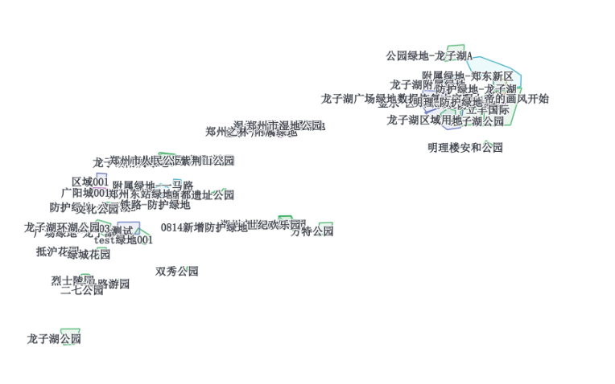

#  geoserver动态配置地图样式

## 背景

公司基于geoserver发布的wms服务--面状矢量图层，想要通过传递参数控制请求的wms服务的填充透明度。

之前都是直接在geoserver中通过配置sld样式，直接配置好，所有参数都是固定的。

网络搜索大量资料，有两种思路：

- **在sld中变量替换，将wms请求中的值传递到sld样式中**
- **通过sld_body动态改变geoserver的图层样式**


## 方案一--sld变量替换+wms请求中添加参数

可参考官方文档：https://docs.geoserver.org/stable/en/user/styling/sld/extensions/substitution.html

实现方式：

- 请求服务时，使用env参数指定变量，后跟name:value由分号分隔的对列表`env=name1:value1;name2:value2`
- sld中，使用env访问变量值，函数检索当前请求中指定的替换变量值
- 也可设置默认值，当在请求中未指定默认值时，将使用默认值

`sld` 样式：

```shell
<se:Rule>
  <se:TextSymbolizer>
    <se:Label>
      <ogc:PropertyName>name</ogc:PropertyName>
    </se:Label>
    <se:Halo>
      <se:Radius>1.2</se:Radius>
      <se:Fill>
        <se:SvgParameter name="fill">#ffffff</se:SvgParameter>
        <se:SvgParameter name="fill-opacity">
          <ogc:Function name="env"> --env访问变量值
            <ogc:Literal>labelOpacity</ogc:Literal> --可替换的变量值
            <ogc:Literal>1</ogc:Literal> --默认值
          </ogc:Function>
        </se:SvgParameter>
      </se:Fill>
    </se:Halo>
    <se:Fill>
      <se:SvgParameter name="fill">#343942</se:SvgParameter>
      <se:SvgParameter name="fill-opacity">
        <ogc:Function name="env">
          <ogc:Literal>labelOpacity</ogc:Literal>
        </ogc:Function>
      </se:SvgParameter>
    </se:Fill>
  </se:TextSymbolizer>
</se:Rule>
```

示例：

[http://117.159.25.220:8081/geoserver/districts/wms?service=WMS&version=1.1.0&request=GetMap&layers=districts%3At_greenbelt_info&bbox=113.589241027832%2C34.7131233215332%2C114.086944580078%2C34.7861442565918&width=768&height=330&srs=EPSG%3A4326&format=application/openlayers&env=labelOpacity:1](http://117.159.25.220:8081/geoserver/districts/wms?service=WMS&version=1.1.0&request=GetMap&layers=districts%3At_greenbelt_info&bbox=113.589241027832%2C34.7131233215332%2C114.086944580078%2C34.7861442565918&width=768&height=330&srs=EPSG%3A4326&format=application/openlayers&env=labelOpacity:1#toggle)



## 方案二--sld_body动态改变图层样式

=============================请等待==============================