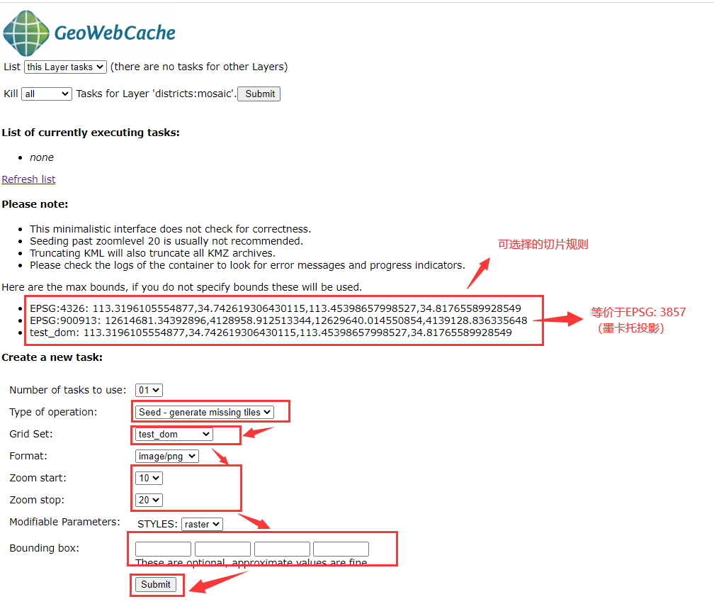

# geoserver发布栅格服务

## 背景

在一个项目中拿到了一个县级市区的正射影像数据（dom），单幅影像70M，共1153幅，tif格式，坐标系为`EPSG:4526(CGCS2000 / 3-degree Gauss-Kruger zone 38)`。公司要求存储该数据并把该数据可以以服务的形式，提供给用户。

对于这个数据，虽然单幅影像数据量不大，但数据总量70M*1153≈79G。于是乎，开始各种折腾。

我的思路过程大概是这样的：

- 将所有影像存入到postgres中，用geoserver的`ImageMosaic`插件进行加载。只可惜这种方法我目前**只能实现前一部分，后一部分还是没研究明白**。第一种方法行不通。
- 然后，我就想，那就切片吧，这样体量的数据，切片总是没错的。
  - 我利用`geoserver` 的 `ImageMosiac` 工 具添加了对象数据源，成功的发布了数据，于是窃喜。
  - 接下来，我计划利用`geoserver`对上一步发布的数据进行切片。但切片速度实在是太慢了，简直是龟速，而且老出问题。现在回想一下，可能是由于数据本身没有融合，从而导致的切片速度慢。
- 现在问题出在切片上，那就从切片上入手。
  - 网络搜索了一下，发现了宝藏切片工具-- `FW Tools` 。
  - 然后使用这个工具对应的`gdal_retile`命令行开心的进行切片。切片速度也还算快，两天，可以接受，比上个方法的龟速不知好了多少。最终拿到了3G多的切片数据。
  - 接下来，利用`geoserver`的 `ImagePyramid` 插件添加切片后的数据源，但问题又来了，输入数据源名称及连接参数，点击保存后，便一直处于貌似正在加载的状态。
  - 当时没有耐心，就直接关闭并重启了服务器。最终发现到这个步骤时，等待就好了（耐心的重要性）。
- 当然，由于我当时耐心不够，继续上网搜索，看到网友说：一个切片等级下的瓦片全在一块，一次需要读取的太多，所以加载速度慢，可以对其按行存储，可以提升加载速度。
  - 于是我想啊，`FW Tool` 使用的是`gdal`，就去`gdal` 的官方网站查看了一下`gdal_retile` 这个函数，发现有个 `-useDirForEachRow` 参数，大致跟我的需求挺相近的，可对同一等级下的瓦片按行进行存储。
  - 方法一：但`FW Tool`使用的 gdal 的老版本，不支持该参数。我就想到了自己电脑上前一段时间安装了`python` 环境，同时也安装了`gdal`，于是马上磨刀霍霍的找到`python` 中安装的`gdal`包的相关文件夹`Python38\Scripts\gdal_retile.py`，使用添加`-useDirForEachRow` 参数的命令行就可以切片啦。但由于切片也需要好几天，于是我采用了第二种方法。
  - 方法二：由于已使用`FW Tool` 切片了，再次切片又需两三天，等不了了。理解了`-useDirForEachRow`参数的原理，于是就写了一个python脚本对同一等级下的瓦片文件按行分类存储，然后两个小时就OK了。
- 最后一种方法完全是自主尝试的，没想到啊，效果很好啊。
  - `arcgis` 中将所有tif文件镶嵌为一个tif文件。
  - `geoserver` 中添加栅格文件（`geotiff`类型）并发布栅格服务mosaic。
  - 自定义切片规则test_dom，坐标系设置为EPSG:4326，范围 [-180, -90, 180, 90]，添加等级0-25级（等级名字`EPSG:4326:0`）
  - 对mosaic图层进行切片前，先在mosiac图层中添加自定义的切片规则test_dom，开始切片，由于范围较小，选择10-20级的进行切片即可。
  - 最后，完整切片后，在`tile layers` 中即可查看。

## 可实现的技术方案一

实现手段：影像镶嵌+`gdal_retile`切片+`geoserver`发布`Image Pyramid` 服务。

### 影像镶嵌

`arcgis` 操作界面或 `arcpy` 中进行镶嵌。

`arcpy` 脚本：

```python
import arcpy
import time

arcpy.env.workspace = "F:\\data\\xy_data_processed\\dom"
arcpy.env.outputCoordinateSystem = arcpy.SpatialReference(4526)

rasters = arcpy.ListRasters()
input_rasters = ";".join(rasters)
print("开始镶嵌====" + time.strftime("%Y-%m-%d %H:%M:%S", time.localtime()))
arcpy.MosaicToNewRaster_management(input_rasters, "F:\\data\\xy_data_processed\\mosaic", "mosaic.tif", '', "8_BIT_UNSIGNED", '', 3)
print("结束镶嵌====" + time.strftime("%Y-%m-%d %H:%M:%S", time.localtime()))
```

### `gdal_retile` 切片

####`FW Tool` 切片

- 下载安装 `FW Tool`
- 打开`FWTool`，进入命令行操作
- 等待切片

```shell
F:\FWTools\FWTools2.4.7\python\python.exe F:\FWTools\FWTools2.4.7\bin\gdal_retile.py -v -r bilinear -levels 18 -ps 256 256 -pyramidOnly -co "TILED=YES" -co COMPRESS=JPEG -co PHOTOMETRIC=YCBCR -targetDir F:\data\xy_data_processed\dom_tiles_new F:\data\xy_data_processed\mosaic\mosaic.tif
```

- 本次切片数据共有快3g，`geoserver` 发布`Image Pyramid` 服务时加载会很慢很慢，所以对`FWTool`切片结果按行划分至对应的行内文件夹内（python脚本实现）

```python
import os
from shutil import copyfile

in_dir = 'F:\\data\\xy_data_processed\\dom_tiles'
out_dir = 'F:\\data\\xy_data_processed\\dom_tiles_1'
in_list = os.listdir(in_dir)
for i in range(0, len(in_list)):
  in_level_dir = os.path.join(in_dir, in_list[i])
  out_level_dir = os.path.join(out_dir, in_list[i])
  if (in_list[i] not in os.listdir(out_level_dir)):
    os.mkdir(out_level_dir)
  in_files = os.listdir(in_level_dir)
  for in_file in in_files:
    out_row = str(int(in_file.split('.')[0].split('_')[1]))
    print(in_level_dir, "====", in_file)
    out_row_dir = os.path.join(out_child_dir, row)
    if (out_row not in os.listdir(out_level_dir)):
      os.mkdir(out_row_dir)
    copyfile(os.path.join(in_level_dir, in_file), os.path.join(out_row_dir, in_file))
```

####  `python`的`gdal`包中的`gdal_retile` 进行切片

- 安装`python` 环境 和 `gdal` 包。
- `python` 安装路径下的`python38/Scripts` 可找到`gdal_retile.py`， 添加`-useDirForEachRow`参数，在命令行中操作。

- 等待切片。

```shell
gdal_retile.py -v -r bilinear -levels 3 -ps 256 256 -pyramidOnly -co “TILED=YES” -co COMPRESS=JPEG -co PHOTOMETRIC=YCBCR -useDirForEachRow -targetDir F:\data\xy_data_processed\test F:\data\xy_data_processed\mosaic\test.tif
```


### `geoserver`发布`Image Pyramid` 服务

- 添加影像金字塔数据源


- 设置数据源的名称及路径（如果数据量较大，请耐心等待）


- 新建图层，发布服务


- 服务参数设置，是熟悉的界面啊


- 服务图层预览


**问题: 通过获取黑边的值发现rgb并不是都为0，0，0，所以在设置完透明值后还是会出现黑边，正在寻找解决方案，后续更新。，暂时没有找到解决办法。**

## 可实现的技术方案二

实现手段：影像镶嵌 +`geoserver` 自定义切片规则 + `geoserver` 中切片。

### `geoserver` 中发布栅格服务


### `geoserver` 自定义切片规则


### geoserver 中切片

- 影像图层中添加自定义的切片规则


- 切片设置




- 切片结果，在geoserver的安装路径下：`data_dir\gwc\districts_mosaic\`，就可以看到切片结果了


- 切片预览


### 高德地图和cesium中加载该切片地图影像

####  cesium加载geoserver的wtms

```javascript
let layer = new Cesium.ImageryLayer(new Cesium.WebMapTileServiceImageryProvider({
    url: 'http://localhost:8081/geoserver/gwc/service/wmts/rest/districts:mosaic/{style}/{TileMatrixSet}/{TileMatrix}/{TileRow}/{TileCol}?format=image/png',
    layer:'districts:mosaic',
    style: 'raster',
    format: 'image/png',
    tileMatrixSetID: 'test_dom',
    tileMatrixLabels: ['EPSG:4326:1', 'EPSG:4326:2', 'EPSG:4326:3', 'EPSG:4326:4', 'EPSG:4326:5', 'EPSG:4326:6', 'EPSG:4326:7', 'EPSG:4326:8', 'EPSG:4326:9', 'EPSG:4326:10', 'EPSG:4326:11', 'EPSG:4326:12', 'EPSG:4326:13', 'EPSG:4326:14', 'EPSG:4326:15','EPSG:4326:16', 'EPSG:4326:17', 'EPSG:4326:18', 'EPSG:4326:19', 'EPSG:4326:20'],
    tilingScheme: new Cesium.GeographicTilingScheme({ // 重点：tileMatrix使用的是自定义的test_dom, scheme设置为默认的2,1时发现层级范围与自定义的tileMatrix层级差一倍
        numberOfLevelZeroTilesX: 4,
        numberOfLevelZeroTilesY: 2 
    }),
    tileWidth: 256,
    tileHeight: 256

}))
this.viewer.imageryLayers.add(layer)
```

结果预览：


#### 高德地图加载geoserver的wtms

- `test_dom` 切片规则是基于`wgs1984`的，而高德地图只读取`EPSG:3875 ` 坐标系的瓦片
- `mosaic.tif`在切片设置时，选择`EPSG:900913`切片规则，切片等级选择10-21级。

```javascript
var layer = new AMap.TileLayer({
    zIndex: 2,
    zooms: 10,
    tileSize: 256,
    getTileUrl: function(x , y, z){
        return `http://localhost:8081/geoserver/gwc/service/wmts?layer=districts:mosaic&style=raster&tilematrixset=EPSG:900913&Service=WMTS&Request=GetTile&Version=1.0.0&Format=image/png&TileMatrix=EPSG:900913:${z}&TileCol=${x}&TileRow=${y}`;
    }
});
layer.setMap(map);
```

结果预览：

