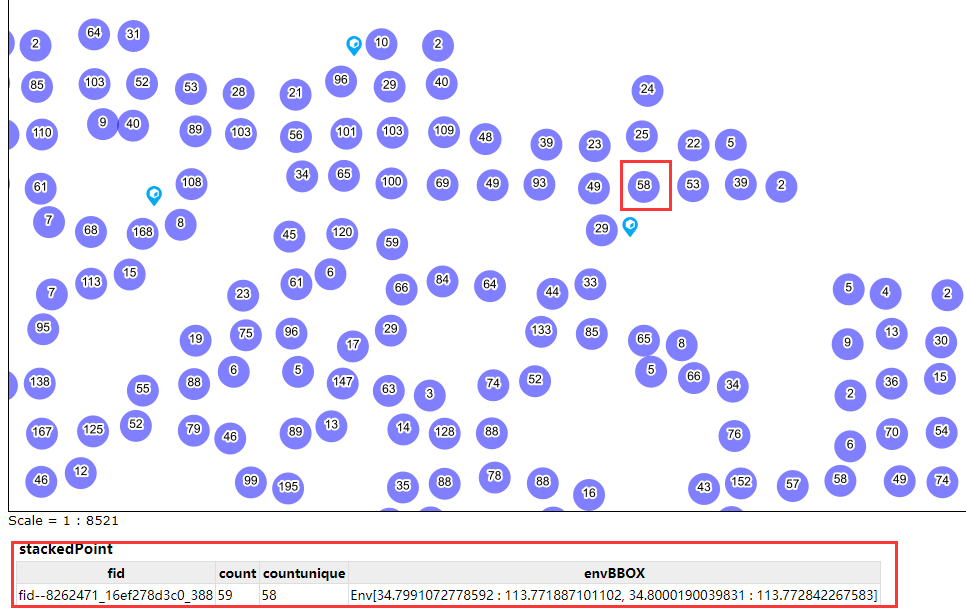

# geoserver-实现聚合效果

## 背景

一个点状图层，数据量大，显示时点互相遮盖，看起来混乱（如图）：


想要在发布地图服务的时候对数据进行聚合。

思路：

- `geoserver`集成的有`render-transform`工具，根据该工具可实现聚合。想要使用该工具，需要安装`wps`插件。


## 方案

geoserver集成的有render-transform工具，根据该工具可实现聚合。想要使用该工具，需要安装wps插件。

参考https://geoserver.geo-solutions.it/edu/en/wps/rendering_tx.html

### 下载插件

注意要安装与你电脑或服务器上geoserver对应的版本:

- `geoserver-2.15.1-wps-plugin.zip`

- `geoserver-2.15.1-wps-cluster-hazelcast-plugin.zip`

下载地址：https://sourceforge.net/projects/geoserver/files/GeoServer/（各个版本的geoserver及其插件，但下载时网速比较慢，也可能出现下载不下来的情况，但坚持不懈会下载下来的）


### 安装插件

- 解压文件之后，将其文件复制至`geoserver`安装处的`webapps\geoserver\WEB-INF\lib`中


- 重启`geoserver`即可
- 验证：主页面左侧导航栏的服务——wps出现，即安装成功。


###  `style`中设置`sld`样式

```shell
<?xml version="1.0" encoding="ISO-8859-1"?>
<StyledLayerDescriptor version="1.0.0"
                       xsi:schemaLocation="http://www.opengis.net/sld StyledLayerDescriptor.xsd"
                       xmlns="http://www.opengis.net/sld" xmlns:ogc="http://www.opengis.net/ogc"
                       xmlns:xlink="http://www.w3.org/1999/xlink" xmlns:xsi="http://www.w3.org/2001/XMLSchema-instance">
    <NamedLayer>
        <Name>g_stacker</Name>
        <UserStyle>

            <Title>Point Stacker</Title>

            <Abstract>A sample style that aggregates points</Abstract>
            <FeatureTypeStyle>
                <Transformation>
                    <ogc:Function name="gs:PointStacker">
                        <ogc:Function name="parameter">
                            ogc:Literaldata/ogc:Literal
                        /ogc:Function
                        <ogc:Function name="parameter">
                            ogc:LiteralcellSize/ogc:Literal
                            ogc:Literal50/ogc:Literal
                        /ogc:Function
                        <ogc:Function name="parameter">
                            ogc:LiteraloutputBBOX/ogc:Literal
                            <ogc:Function name="env">
                                ogc:Literalwms_bbox/ogc:Literal
                            /ogc:Function
                        /ogc:Function
                        <ogc:Function name="parameter">
                            ogc:LiteraloutputWidth/ogc:Literal
                            <ogc:Function name="env">
                                ogc:Literalwms_width/ogc:Literal
                            /ogc:Function
                        /ogc:Function
                        <ogc:Function name="parameter">
                            ogc:LiteraloutputHeight/ogc:Literal
                            <ogc:Function name="env">
                                ogc:Literalwms_height/ogc:Literal
                            /ogc:Function
                        /ogc:Function
                    /ogc:Function
                </Transformation>
                <Rule>
                    <ogc:Filter xmlns:ogc="http://www.opengis.net/ogc">
                        ogc:And
                            ogc:PropertyIsEqualTo
                                ogc:PropertyNamecountunique/ogc:PropertyName
                                ogc:Literal1/ogc:Literal
                            /ogc:PropertyIsEqualTo
                            ogc:PropertyIsEqualTo
                                ogc:PropertyNamebig_national_code/ogc:PropertyName
                                ogc:Literal05/ogc:Literal
                            /ogc:PropertyIsEqualTo
                        /ogc:And
                    /ogc:Filter
                    <PointSymbolizer>
                        <Graphic>
                            <ExternalGraphic>
                                <OnlineResource xlink:href="fwtd.svg" xlink:type="simple"/>
                                <Format>image/svg</Format>
                            </ExternalGraphic>
                            
                                <WellKnownName>circle</WellKnownName>
                                <Fill>
                                    <CssParameter name="fill">#0000FF</CssParameter>
                                    <CssParameter name="fill-opacity">0.5</CssParameter>
                                </Fill>
                            
                            <Size>20</Size>
                        </Graphic>
                    </PointSymbolizer>
                </Rule>
                <Rule>
                    <ogc:Filter xmlns:ogc="http://www.opengis.net/ogc">
                        ogc:And
                            ogc:PropertyIsEqualTo
                                ogc:PropertyNamecountunique/ogc:PropertyName
                                ogc:Literal1/ogc:Literal
                            /ogc:PropertyIsEqualTo
                            ogc:PropertyIsEqualTo
                                ogc:PropertyNamebig_national_code/ogc:PropertyName
                                ogc:Literal21/ogc:Literal
                            /ogc:PropertyIsEqualTo
                        /ogc:And
                    /ogc:Filter
                    <PointSymbolizer>
                        <Graphic>
                            <ExternalGraphic>
                                <OnlineResource xlink:href="kz.svg" xlink:type="simple"/>
                                <Format>image/svg</Format>
                            </ExternalGraphic>
                            
                                <WellKnownName>circle</WellKnownName>
                                <Fill>
                                    <CssParameter name="fill">#0000FF</CssParameter>
                                    <CssParameter name="fill-opacity">0.5</CssParameter>
                                </Fill>
                            
                            <Size>20</Size>
                        </Graphic>
                    </PointSymbolizer>
                </Rule>
                <Rule>
                    <ogc:Filter xmlns:ogc="http://www.opengis.net/ogc">
                        ogc:And
                            ogc:PropertyIsEqualTo
                                ogc:PropertyNamecountunique/ogc:PropertyName
                                ogc:Literal1/ogc:Literal
                            /ogc:PropertyIsEqualTo
                            ogc:PropertyIsEqualTo
                                ogc:PropertyNamebig_national_code/ogc:PropertyName
                                ogc:Literal01/ogc:Literal
                            /ogc:PropertyIsEqualTo
                        /ogc:And
                    /ogc:Filter
                    <PointSymbolizer>
                        <Graphic>
                            <ExternalGraphic>
                                <OnlineResource xlink:href="gyss.svg" xlink:type="simple"/>
                                <Format>image/svg</Format>
                            </ExternalGraphic>
                            
                                <WellKnownName>circle</WellKnownName>
                                <Fill>
                                    <CssParameter name="fill">#0000FF</CssParameter>
                                    <CssParameter name="fill-opacity">0.5</CssParameter>
                                </Fill>
                            
                            <Size>20</Size>
                        </Graphic>
                    </PointSymbolizer>
                </Rule>
                <Rule>
                    <ogc:Filter xmlns:ogc="http://www.opengis.net/ogc">
                        ogc:And
                            ogc:PropertyIsEqualTo
                                ogc:PropertyNamecountunique/ogc:PropertyName
                                ogc:Literal1/ogc:Literal
                            /ogc:PropertyIsEqualTo
                            ogc:PropertyIsEqualTo
                                ogc:PropertyNamebig_national_code/ogc:PropertyName
                                ogc:Literal02/ogc:Literal
                            /ogc:PropertyIsEqualTo
                        /ogc:And
                    /ogc:Filter
                    <PointSymbolizer>
                        <Graphic>
                            <ExternalGraphic>
                                <OnlineResource xlink:href="jthjss.svg" xlink:type="simple"/>
                                <Format>image/svg</Format>
                            </ExternalGraphic>
                            
                                <WellKnownName>circle</WellKnownName>
                                <Fill>
                                    <CssParameter name="fill">#0000FF</CssParameter>
                                    <CssParameter name="fill-opacity">0.5</CssParameter>
                                </Fill>
                            
                            <Size>20</Size>
                        </Graphic>
                    </PointSymbolizer>
                </Rule>
                <Rule>
                    <ogc:Filter xmlns:ogc="http://www.opengis.net/ogc">
                        ogc:And
                            ogc:PropertyIsEqualTo
                                ogc:PropertyNamecountunique/ogc:PropertyName
                                ogc:Literal1/ogc:Literal
                            /ogc:PropertyIsEqualTo
                            ogc:PropertyIsEqualTo
                                ogc:PropertyNamebig_national_code/ogc:PropertyName
                                ogc:Literal03/ogc:Literal
                            /ogc:PropertyIsEqualTo
                        /ogc:And
                    /ogc:Filter
                    <PointSymbolizer>
                        <Graphic>
                            <ExternalGraphic>
                                <OnlineResource xlink:href="srhjss.svg" xlink:type="simple"/>
                                <Format>image/svg</Format>
                            </ExternalGraphic>
                            
                                <WellKnownName>circle</WellKnownName>
                                <Fill>
                                    <CssParameter name="fill">#0000FF</CssParameter>
                                    <CssParameter name="fill-opacity">0.5</CssParameter>
                                </Fill>
                            
                            <Size>20</Size>
                        </Graphic>
                    </PointSymbolizer>
                </Rule>
                <Rule>
                    <ogc:Filter xmlns:ogc="http://www.opengis.net/ogc">
                        ogc:And
                            ogc:PropertyIsEqualTo
                                ogc:PropertyNamecountunique/ogc:PropertyName
                                ogc:Literal1/ogc:Literal
                            /ogc:PropertyIsEqualTo
                            ogc:PropertyIsEqualTo
                                ogc:PropertyNamebig_national_code/ogc:PropertyName
                                ogc:Literal03/ogc:Literal
                            /ogc:PropertyIsEqualTo
                            ogc:PropertyIsEqualTo
                                ogc:PropertyNamesmall_national_code/ogc:PropertyName
                                ogc:Literal01/ogc:Literal
                            /ogc:PropertyIsEqualTo
                        /ogc:And
                    /ogc:Filter
                    <PointSymbolizer>
                        <Graphic>
                            <ExternalGraphic>
                                <OnlineResource xlink:href="gc.svg" xlink:type="simple"/>
                                <Format>image/svg</Format>
                            </ExternalGraphic>
                            
                                <WellKnownName>circle</WellKnownName>
                                <Fill>
                                    <CssParameter name="fill">#0000FF</CssParameter>
                                    <CssParameter name="fill-opacity">0.5</CssParameter>
                                </Fill>
                            
                            <Size>20</Size>
                        </Graphic>
                    </PointSymbolizer>
                </Rule>
                <Rule>
                    <ogc:Filter xmlns:ogc="http://www.opengis.net/ogc">
                        ogc:And
                            ogc:PropertyIsEqualTo
                                ogc:PropertyNamecountunique/ogc:PropertyName
                                ogc:Literal1/ogc:Literal
                            /ogc:PropertyIsEqualTo
                            ogc:PropertyIsEqualTo
                                ogc:PropertyNamebig_national_code/ogc:PropertyName
                                ogc:Literal04/ogc:Literal
                            /ogc:PropertyIsEqualTo
                        /ogc:And
                    /ogc:Filter
                    <PointSymbolizer>
                        <Graphic>
                            <ExternalGraphic>
                                <OnlineResource xlink:href="yllhss.svg" xlink:type="simple"/>
                                <Format>image/svg</Format>
                            </ExternalGraphic>
                            
                                <WellKnownName>circle</WellKnownName>
                                <Fill>
                                    <CssParameter name="fill">#0000FF</CssParameter>
                                    <CssParameter name="fill-opacity">0.5</CssParameter>
                                </Fill>
                            
                            <Size>20</Size>
                        </Graphic>
                    </PointSymbolizer>
                </Rule>
                <Rule>
                    <ogc:Filter xmlns:ogc="http://www.opengis.net/ogc">
                        ogc:And
                            ogc:PropertyIsEqualTo
                                ogc:PropertyNamecountunique/ogc:PropertyName
                                ogc:Literal1/ogc:Literal
                            /ogc:PropertyIsEqualTo
                            ogc:PropertyIsEqualTo
                                ogc:PropertyNamebig_national_code/ogc:PropertyName
                                ogc:Literal06/ogc:Literal
                            /ogc:PropertyIsEqualTo
                        /ogc:And
                    /ogc:Filter
                    <PointSymbolizer>
                        <Graphic>
                            <ExternalGraphic>
                                <OnlineResource xlink:href="qtbj.svg" xlink:type="simple"/>
                                <Format>image/svg</Format>
                            </ExternalGraphic>
                            
                                <WellKnownName>circle</WellKnownName>
                                <Fill>
                                    <CssParameter name="fill">#0000FF</CssParameter>
                                    <CssParameter name="fill-opacity">0.5</CssParameter>
                                </Fill>
                            
                            <Size>20</Size>
                        </Graphic>
                    </PointSymbolizer>
                </Rule>
                <Rule>
                    <ogc:Filter xmlns:ogc="http://www.opengis.net/ogc">
                        ogc:And
                            ogc:PropertyIsEqualTo
                                ogc:PropertyNamecountunique/ogc:PropertyName
                                ogc:Literal1/ogc:Literal
                            /ogc:PropertyIsEqualTo
                            ogc:Or
                                ogc:PropertyIsEqualTo
                                    ogc:PropertyNamebig_national_code/ogc:PropertyName
                                    ogc:Literal/ogc:Literal
                                /ogc:PropertyIsEqualTo
                                ogc:PropertyIsNull
                                    ogc:PropertyNamebig_national_code/ogc:PropertyName
                                /ogc:PropertyIsNull
                            /ogc:Or
                        /ogc:And
                    /ogc:Filter
                    <PointSymbolizer>
                        <Graphic>
                            <ExternalGraphic>
                                <OnlineResource xlink:href="gyss.svg" xlink:type="simple"/>
                                <Format>image/svg</Format>
                            </ExternalGraphic>
                            
                                <WellKnownName>circle</WellKnownName>
                                <Fill>
                                    <CssParameter name="fill">#0000FF</CssParameter>
                                    <CssParameter name="fill-opacity">0.5</CssParameter>
                                </Fill>
                            
                            <Size>20</Size>
                        </Graphic>
                    </PointSymbolizer>
                </Rule>
                <Rule>
                    <ogc:Filter xmlns:ogc="http://www.opengis.net/ogc">
                        ogc:PropertyIsGreaterThan
                            ogc:PropertyNamecountunique/ogc:PropertyName
                            ogc:Literal1/ogc:Literal
                        /ogc:PropertyIsGreaterThan
                    /ogc:Filter
                    <PointSymbolizer>
                        <Graphic>
                            
                                <WellKnownName>circle</WellKnownName>
                                <Fill>
                                    <CssParameter name="fill">#0000FF</CssParameter>
                                    <CssParameter name="fill-opacity">0.5</CssParameter>
                                </Fill>
                            
                            <Size>32</Size>
                        </Graphic>
                    </PointSymbolizer>
                    <TextSymbolizer>
                        <Label>
                            ogc:PropertyNamecountunique/ogc:PropertyName
                        </Label>
                        
                            <CssParameter name="font-family">Arial</CssParameter>
                            <CssParameter name="font-size">12.0</CssParameter>
                            <CssParameter name="font-style">normal</CssParameter>
                            <CssParameter name="font-weight">normal</CssParameter>
                        
                        <LabelPlacement>
                            <PointPlacement>
                                <AnchorPoint>
                                    <AnchorPointX>
                                        ogc:Literal0.5/ogc:Literal
                                    </AnchorPointX>
                                    <AnchorPointY>
                                        ogc:Literal0.5/ogc:Literal
                                    </AnchorPointY>
                                </AnchorPoint>
                                <Rotation>
                                    ogc:Literal0.0/ogc:Literal
                                </Rotation>
                            </PointPlacement>
                        </LabelPlacement>
                        <Halo>
                            <Radius>
                                ogc:Literal2/ogc:Literal
                            </Radius>
                            <Fill>
                                <CssParameter name="fill">#FFFFFF</CssParameter>
                            </Fill>
                        </Halo>
                        <Fill>
                            <CssParameter name="fill">#000000</CssParameter>
                        </Fill>
                    </TextSymbolizer>
                </Rule>
            </FeatureTypeStyle>
        </UserStyle>
    </NamedLayer>
</StyledLayerDescriptor>

```


## 示例

- 引用（两个图层叠加）

http://localhost:8081/geoserver/districts/wms?service=WMS&version=1.1.0&request=GetMap&layers=districts:t_basic_component,districts:t_basic_component&styles=districts:t_basic_component,districts:g_stacker&bbox=113.69,34.75,113.84,34.83&width=1500&height=800&srs=EPSG:4326&format=application/openlayers

- 效果预览


## 存在问题

在规则中，无法识别转换前图层的属性，导致图标显示不正确。（有待解决）

怎么能够正确识别转换前图层的属性？


