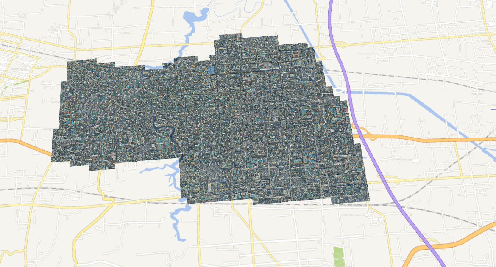

# 高德地图和cesium中加载该切片地图影像

## cesium加载geoserver的wtms

加载以`EPSG:4326`为切片规则的瓦片的方法：

```javascript
let layer = new Cesium.ImageryLayer(new Cesium.WebMapTileServiceImageryProvider({
    url: 'http://localhost:8081/geoserver/gwc/service/wmts/rest/districts:mosaic/{style}/{TileMatrixSet}/{TileMatrix}/{TileRow}/{TileCol}?format=image/png',
    layer:'districts:mosaic', // 栅格图层（注意修改）
    style: 'raster',
    format: 'image/png',
    tileMatrixSetID: 'test_dom', //切片规则（注意修改）
    tileMatrixLabels: ['EPSG:4326:1', 'EPSG:4326:2', 'EPSG:4326:3', 'EPSG:4326:4', 'EPSG:4326:5', 'EPSG:4326:6', 'EPSG:4326:7', 'EPSG:4326:8', 'EPSG:4326:9', 'EPSG:4326:10', 'EPSG:4326:11', 'EPSG:4326:12', 'EPSG:4326:13', 'EPSG:4326:14', 'EPSG:4326:15','EPSG:4326:16', 'EPSG:4326:17', 'EPSG:4326:18', 'EPSG:4326:19', 'EPSG:4326:20'], //切片规则各个等级名称（注意修改）
    tilingScheme: new Cesium.GeographicTilingScheme({ // 重点：tileMatrix使用的是自定义的test_dom, scheme设置为默认的2,1时发现层级范围与自定义的tileMatrix层级差一倍
        numberOfLevelZeroTilesX: 4,
        numberOfLevelZeroTilesY: 2 
    }),
    tileWidth: 256,
    tileHeight: 256

}))
this.viewer.imageryLayers.add(layer)
```

结果预览：



## 高德地图加载geoserver的wtms

加载以`EPSG:900913`为切片规则的瓦片的方法

- `test_dom` 切片规则是基于`wgs1984`的，而高德地图只读取`EPSG:3875 ` 坐标系的瓦片
- `mosaic.tif`在切片设置时，选择`EPSG:900913`切片规则，切片等级选择10-21级。

```javascript
var layer = new AMap.TileLayer({
    zIndex: 2,
    zooms: 10,
    tileSize: 256,
    getTileUrl: function(x , y, z){
        return `http://localhost:8081/geoserver/gwc/service/wmts?layer=districts:mosaic&style=raster&tilematrixset=EPSG:900913&Service=WMTS&Request=GetTile&Version=1.0.0&Format=image/png&TileMatrix=EPSG:900913:${z}&TileCol=${x}&TileRow=${y}`;
    } //tilematrixset=EPSG:900913（切片规则注意修改）
});
layer.setMap(map);
```

结果预览：

